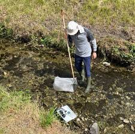
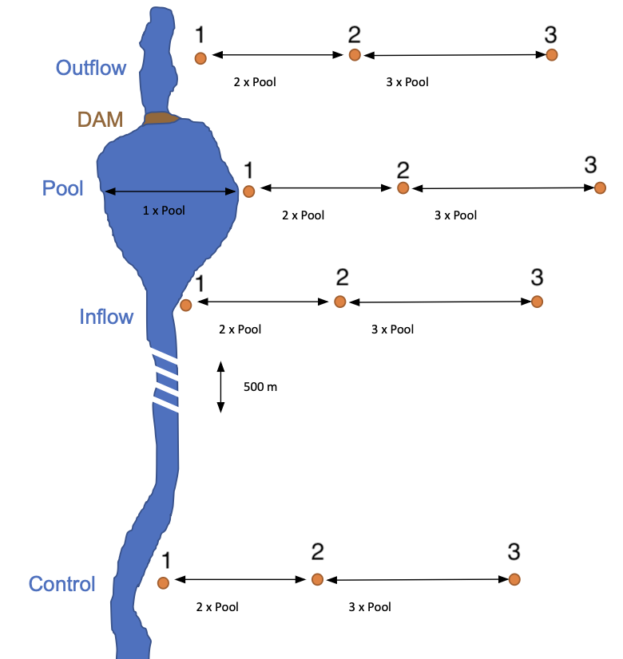
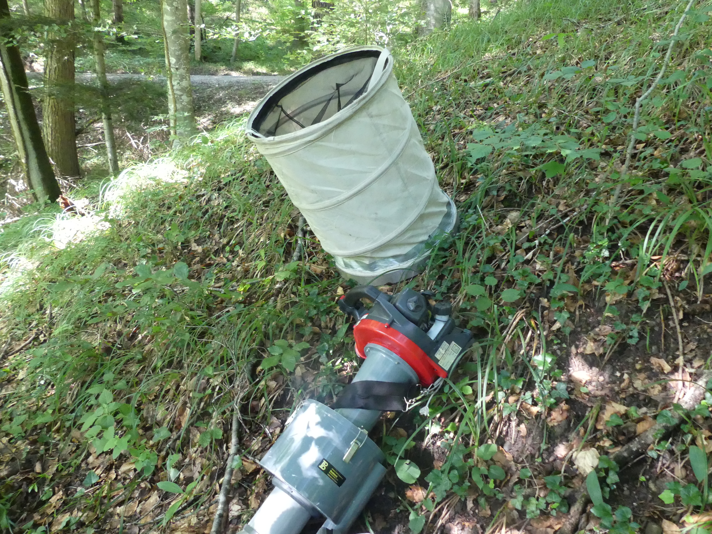
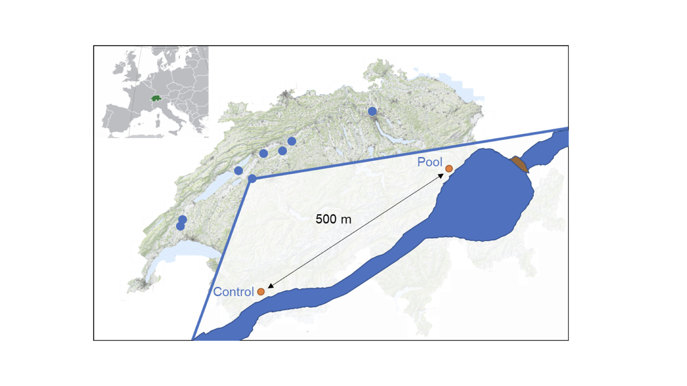
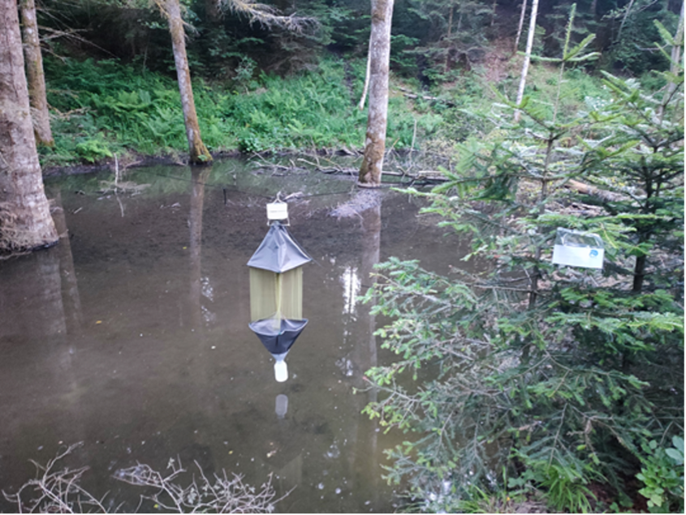

```{r load_libraries}

library(tidyverse)
library(here)
library(knitr)
library(ggdist)
library(readxl)
library(DT)
```

```{r ggplot_theme}
newtheme <- theme_bw(base_size = 14) 
theme_set(newtheme)
```

## Introduction

First of all: What are the open research questions we want to answer?

::: {.callout-important appearance="simple"}
**Open questions:**

-   Does beaver damming influence arthropod individual size distribution (ISD)?

-   Does anthropogenic land area mediate the beaver effect on arthropods ISD ?

-   ... your question (maybe something about terrestrial vs aquatic ISD) ?
:::

In order to answer these questions, we have sampled the arthropod community across Swiss streams dammed by beavers. We have used three (3) different methods, catching different insect taxons. The three methods from now on we defined as: `intercept_trap`, `kick_net`, `suction`.

## Kick net: aquatic invertebrates community

### **Description**

The aquatic invertebrates community was collected by Ph.D student [Valentin Moser](https://www.wsl.ch/de/mitarbeitende/moserval/) , UZH Master student [Dominic Tinner](https://dominictinner.pro) and Patrick Hofmann within the WSL-Eawag project: [Species interactions in beaver engineered habitats link land-water ecosystem processes](https://www.wsl.ch/de/projekte/sfsf/). They sampled 14 streams with beaver presence across Switzerland (@fig-tinner). The streams varied in surrounding land use intensity (urban, agricultural, or forest, see @sec-typo ) and stream ecomorphology, (i.e., the structural stream characteristics @sec-streamecomorpho ).

{#fig-tinner fig-align="center"}

In each stream, four distinct locations were sampled: the lotic-lentic transition upstream of the dam (inflow), the stagnant water behind the dam (pond), a lotic stream section 25 m downstream of the dam (outflow), and a reach without any influence of beaver engineering (control) @fig-tinner2. The control location was located 500 metres upstream of the main dam at eight sites and 500 metres downstream at the other eight sites. This design assumed that the control location represented the stream habitats as they would have existed prior to the arrival of the beaver in the stream. This assures a comprehensive understanding of the beavers' effect on the freshwater ecosystem by comparing sections directly affected by the dams (i.e. inflow, pond, outflow) with those in their initial state (control).

![Schematic overview of the study design. This illustration depicts the arrangement of sample locations in relation to the beaver dam across the studied streams. Control reaches were set either 500 m upstream of the inflow or 500 m downstream of the outflow, with an equal distributioon of upstream and downstream control reaches across the 16 studied streams. Each sample location was sampled four time consecutively, each focusing on different microhabitats. Additionally, light blue stream colour denotes lotic (fast-flowing) conditions, while dark blue represents the lentic (standing water) conditions in ponds, signifying typical stream current velocity. Credits and copyrights to Dominic Tinner.](images/tinner_fig_2.png){#fig-tinner2 fig-align="center"}

The aquatic invertebrate sampling was conducted in May/June of 2021 or 2022 with the [kick-net method](https://www.google.com/url?sa=t&source=web&rct=j&opi=89978449&url=https://www.bafu.admin.ch/dam/bafu/de/dokumente/wasser/uv-umwelt-vollzug/methoden-zur-untersuchung-und-beurteilung-der-fliessgewaesser.pdf.download.pdf/methoden-zur-untersuchung-und-beurteilung-der-fliessgewaesser.pdf&ved=2ahUKEwiBh4fwuKiPAxVa1wIHHTt2NdoQFnoECBYQAQ&usg=AOvVaw1P_RymaemFv9YDq0ukSA8Z) (@fig-kicknet). During kick-net sampling, the collector kicks up the sediment in a 0.25 x 0.25 meter area of the stream for 20 seconds while a net is placed downstream of the sampling area to collect swirled-up invertebrates. Each sample location (e.g. inflow) was sampled four times consecutively to capture different microhabitats, with two samples in organic substrates (e.g., submerged macrophytes, roots) and two samples in non-organic substrates (e.g., gravel, sand). The content of the net was then transferred to plastic tubs, where aquatic invertebrates were picked out by hand for a duration of 15 minutes. After this time, the remaining content was washed in the stream (similar to gold panning), leaving only fine sediment with remaining individuals. This was stored together with the picked-out invertebrates in \[97% ethanol. The sampling in each stream was completed within one day, moving upstream to avoid impacting subsequent samples.

[{#fig-kicknet}](https://umwelt.tg.ch/public/upload/assets/173800/3_Lebendiger%20Dorfbach_Dominic%20Tinner.pdf?fp=1)

### Predictors description:

**Human influence**

These variable represents soil cover extension (square meters $m^2$ ) that is defined as agriculture or urban. by Valentin Moser downloaded soil area extension for each site from Geodienste.ch and swisstopo.admin.ch using ARCGIS (Pro v. 2.8, Esri Inc., 2021 und QGIS 3.40 'Bratislava' 2024). He selected a radius of 250 meters around the center of each `Pool` and `Control` location. A visual inspection of the data showed highly reliable classification for agricultural (e.g., crop fields, pastures, areas that farmers maintain for biodiversity) and natural (e.g., forests, riparian areas) land-use. Areas without classified land-use were very often urban areas and human infrastructure, such as streets, railways, and housing. Therefore, missing data was assigned to urban land-use. [V. Moser](valentin.moser@wsl.ch) averaged the sum of agricultural, urban, and natural land-use cover types per site across `Pool` and `Control`. Finally, he aggregated agricultural and urban land cover estimates into an overall human impact variable called `human_influence`**.**

**Stream ecomorphology**

The classification of ecomorphology index considered factors such as riparian zone modifications and structural alterations of stream beds to provide an estimate of the degree of anthropogenic impact. The streams included in this study belonged to the first three of the five ecomorphology categories, ranging from near-natural (category level 1) to slightly impacted (2) and heavily impacted (3). The values for ecomorphology were retrieved for each stream from the Swiss Geoportal, specifically the map layer ‘Ecomorphology Level F – River reaches‘ ([link to access](https://www.geo.admin.ch/de/datensatz-27052021-wie-naturnah-sind-unsere-baeche-und-fluesse-oekomorphologie-stufe-f-bafu)).

### Load raw data

```{r load_macrozoo}

m = read_csv(here("data", "raw", "mzb_size_measurements.csv")) |> select(-c(author))

```

### Add predictors

**Pond area and ecomorphology**

Let's load the covariates/predictors we are interested in: pond area and ecomorphology.

```{r site_info}
# load site info 

site_info <- read_csv(here("data", "raw" , "site_info.csv")) |> 
  select (c(2:5,8,9,19,23)) |> 
  select(-c(site, sample))

```

Merge data frames:

```{r merge_macro_site}

m1 <- m  |> 
  left_join(site_info, by = "laufnummer") |> 
  select("laufnummer","site","location","taxon","family" ,"taxon_lowest","size","ecomorphology",    "area_pool")
  
```

**Human influence**

```{r add_human_influence1}

h = read_csv(here("data","raw","landuse_valentin.csv")) |> select(2,7)
# just get the unique value by site 
h_unique <- h  |> 
  distinct(site, human_influence)  |> 
  arrange(site, human_influence)

```

Merge the `human influence` variable derived by V. Moser to the processed data frame:

```{r merge_hum_influence}

m2 <- m1  |> 
  left_join(h_unique, by = "site") 

```

Now we are going to:

-   Renames the existing `location` column to `location_old`.

-   Creates a new column `location` where the first three categories (`inflow`, `outflow`, `pool`) are all grouped under `"beaver"`, and the fourth category stays as it is.

```{r recall_location_column}

m3 <- m2 %>%
            
  mutate(method = "kick_net") |> 
  rename(  order  = taxon, 
            length = size)
```

Plot the standardized human influence by site:

```{r plot_hum_influe-std}
# standardise human_influence (z-score)
h_std <- h %>%
  mutate(human_influence_std = scale(human_influence)[,1])

# plot
ggplot(h_std, aes(x = site, y = human_influence_std)) +
  geom_point(color = "steelblue", size = 3, shape = 21) +
geom_hline(yintercept = 0)+
  labs(
    title = "Standardised Human Influence by Site",
    x = "Site",
    y = "Human Influence (standardised)"
  ) +
  theme(axis.text.x = element_text(angle = 45, hjust = 1))

```

The sites with above-average human influence (\> 0) are: `r paste(h_std %>% filter(human_influence_std > 0) %>% distinct(site) %>% pull(site), collapse = ", ")`.

Now we are going to estimate median, mean, standard deviation and number of observations for each location.

```{r summarise }
# Summarize stats per location
stats <- m3 %>%
  group_by(location) %>%
  summarise(
    n = n(),
    mean_size = mean(length, na.rm = TRUE),
    sd_size = sd(length, na.rm = TRUE),
    median_size = median(length, na.rm = TRUE)
  )
```

Just one more clean data step:

```{r clean_macrozoobenthos}

m3  |> filter(family != taxon_lowest)

# since there are no difference between the two columns, we remove one of them 

m4 <- m3|> select(-taxon_lowest, -laufnummer) 
```

### Save the processed data: 

```{r save_kicknet_processed}

write.csv(m4, here("data","processed", "kicknet_clean.csv" ))
```

### Visualize

```{r plot_macro}

ggplot(m3, aes(x = length, fill = location)) +
  geom_histogram(binwidth = 1, color = "black", alpha = 0.3, position = "dodge") +
  labs(
    title = "Histogram of arthropod ISD by location (kick net method)",
    x = "Length (mm)",
    y = "Abundance",
    fill = "Location"
  ) + 
  geom_text(
    data = stats,
    aes(
      x = 35,                # fixed at 20 mm
      y = 500,          # map y to location
      label = paste0("n=", n, "\nmean=", round(mean_size,1),
                     "\nsd=", round(sd_size,1),
                     "\nmedian=", round(median_size,1))
    ))+
  facet_wrap(~location) 
```

### How many families did we catch?

First let's check which families are there ! We will extract unique combination of order - family and check how many families are there.

```{r howmanyfamilies}

# Unique family levels
levels_m4 <- unique(m4$family)

# Total families in m4
total_m4 <- length(levels_m4)

# Print results
cat("Total number of observed arthropod families sampled by kick net:", total_m4, "\n")

```

Then we describe each family:

```{r table_families_kicknet}

families <- tibble::tibble(
  No = 1:76,
  Family = c(
    "Rhyacophilidae","Hydropsychidae","Sericostomatidae","Goeridae","Ephemerellidae",
    "Baetidae","Simuliidae","Chironomidae","Gammaridae","Psychodidae","Hydracarina",
    "Hydrobiidae","Elmidae","Curculionidae","Ephemeridae","Caenidae","Limoniidae",
    "Ceratopogonidae","Athericidae","Hydroptilidae","Leuctridae","Corixidae",
    "Asellidae","Calopterygidae","Sphaeriidae","Physidae","Lymnaeidae","Dixidae",
    "Dytiscidae","Haliplidae","Tipulidae","Cordulegastridae","Leptophlebiidae",
    "Planorbidae","Aeshnidae","Culicidae","Coenagrionidae","Bithyniidae","Heptageniidae",
    "Polycentropodidae","Limnephilidae","Odontoceridae","Dugesiidae","Scirtidae",
    "Nemouridae","Lepidostomatidae","Libellulidae","Gerridae","Glossiphoniidae",
    "Gomphidae","Veliidae","Erpobdellidae","Stratiomyidae","Leptoceridae","Tabanidae",
    "Anthomyiidae","Notonectidae","Pleidae","Sialidae","Lestidae","Brachycentridae",
    "Hydrophilidae","Ancylidae","Empididae","Psychomyiidae","Astacidae","Hydraenidae",
    "Syrphidae","Chrysomelidae","Platycnemididae","Chaoboridae","Dryopidae","Nepidae",
    "Corduliidae","Naucoridae","Ecnomidae"
  ),
  Ecology = c(
    "Free-living predatory caddisflies in fast streams",
    "Net-spinning caddisflies, filter feeders in flowing water",
    "Case-building caddisflies in cool streams",
    "Case-building caddisflies on stony substrates",
    "Mayflies, grazers in clean streams",
    "Small mayflies, algal grazers, tolerant",
    "Blackflies, filter feeders in running water",
    "Midges, very diverse, sediment dwellers",
    "Freshwater amphipods, shredders and detritivores",
    "Drain flies, semi-aquatic in organic-rich habitats",
    "Water mites, parasitic/predatory",
    "Freshwater snails, grazers",
    "Riffle beetles, scrapers in clean streams",
    "Weevils, aquatic plant feeders",
    "Burrowing mayflies in fine sediments",
    "Small mayflies in slow waters",
    "Crane flies, detritivores in moist soils and streams",
    "Biting midges, some predatory",
    "Snipe flies, predatory larvae",
    "Micro-caddisflies, case-builders on vegetation",
    "Stoneflies, shredders in streams",
    "Water boatmen, omnivorous swimmers",
    "Aquatic isopods, detritivores",
    "Damselflies, predatory larvae in streams",
    "Small freshwater bivalves, filter feeders",
    "Pond snails, grazers in lentic habitats",
    "Pond snails, algae grazers",
    "Phantom midges, larvae in still waters",
    "Predaceous diving beetles, active predators",
    "Crawling water beetles, algal grazers",
    "Crane flies, detritivores in sediments",
    "Dragonflies, predatory nymphs in streams",
    "Mayflies, sprawlers on rocks",
    "Ramshorn snails, algal grazers",
    "Dragonflies, strong predatory larvae",
    "Mosquitoes, larvae filter feed in still water",
    "Damselflies, predatory larvae in vegetation",
    "Small snails, grazers",
    "Mayflies, flattened scrapers in riffles",
    "Caddisflies, case-building predators",
    "Caddisflies, detritivores/shredders",
    "Caddisflies, case-builders with sand/gravel",
    "Flatworms, predators/scavengers",
    "Marsh beetles, algal feeders",
    "Stoneflies, shredders in cool streams",
    "Caddisflies, case-builders in clean water",
    "Dragonflies, predatory larvae",
    "Water striders, surface predators",
    "Leeches, ectoparasites",
    "Dragonflies, burrowing predators",
    "Small water striders, predators",
    "Leeches, predatory scavengers",
    "Soldier flies, detritivores",
    "Long-horned caddisflies, case-building larvae",
    "Horse flies, predatory larvae",
    "Root maggots, detritivores",
    "Backswimmers, predatory insects",
    "Small backswimmers, predators",
    "Alderflies, predatory larvae",
    "Damselflies, predatory larvae",
    "Caddisflies, case-builders, detritivores",
    "Water scavenger beetles, omnivores",
    "Freshwater limpets, grazers",
    "Dance flies, predatory larvae",
    "Caddisflies, tube-building filter feeders",
    "Crayfish, omnivorous benthic crustaceans",
    "Minute aquatic beetles, scrapers",
    "Hoverflies, some aquatic detritivores",
    "Leaf beetles, plant feeders",
    "Damselflies, predatory larvae",
    "Phantom midges, predatory larvae",
    "Whirligig beetles, surface predators",
    "Water scorpions, ambush predators",
    "Dragonflies, predatory larvae",
    "Creeping water bugs, predators",
    "Caddisflies, case-building detritivores"
  )
)

# interactive sortable table with cross-reference
datatable(
  families,
  options = list(pageLength = 15, autoWidth = TRUE),
  caption = htmltools::tags$caption(
    style = 'caption-side: top; text-align: left;',
    'Table: ', htmltools::tags$strong('Kick-net invertebrate families and their ecology'),
    id = "tbl-tablekicknet"
  )
)
```

## Suction: terrestrial invertebrates community

### **Description**

This data was collected by Ph.D student Valentin Moser and Master students in 2021 and 2022 within 16 different streams in Switzerland. In each stream they sampled in 4 locations: `control`, `inflow`, `pool`, `outflow`. They sampled terrestrial arthropods by using a 5 x 1 m plots located at three different point-locations (i.e. column `point`): one meter from the stream's edge (**1**), at 2 times the pool width distance (**2**) and 3 times the pool width distance (**3**) (i.e.,orange points in @fig-suctiondesign. Within each plot, they sampled the arthropods at the two ends of the 5 x 1 m plot in cylindrical baskets (50 cm diameter, 67 cm height, woven fabric) using suction sampling on a sunny day between 10:00-17:00 during peak arthropod activity @fig-suction. The samples were stored in ethanol, individuals were counted, measured and identified to order level with the help of a binocular.

{#fig-suctiondesign}

[{#fig-suction}](https://onlinelibrary.wiley.com/doi/10.1111/eea.12952)

### Load raw data

```{r load_suction_data_2021}

t = read_csv(here("data","raw","suction_clean.csv")) |> rename(replicates = point_rep)

```

```{r makenewcolumn}
t2 <- t  |> 
  mutate(
    point    = str_extract(sample, "(?<=_)\\d+"),   # extract number
    location = str_remove(sample, "_\\d+$")        # remove suffix
  )  |> 
  relocate(location, point, .after = site) %>%     # put after site
  relocate(replicates, .after = point) %>%         # ensure replicates stays after point
  select(-sample)                                  # drop old column if not needed
```

### Add predictors

**Pond area and ecomorphology**

First we add the area of the beaver pond, and the stream ecomorphology.

```{r add_predictors_suctions}
# load site info 

site_info <- read_csv(here("data", "raw" , "site_info.csv")) |> select (c(2,19,23)) 
# meerge site info to t21 df 
t3 <- t2 %>%
  left_join(site_info, by = "laufnummer") 

# To see rows with NA in size
t4 <-  t3 %>% filter(!is.na(length))
```

**Human influence**

Then we add the `human_influence` variable:

```{r add_humn_influence_suction}

t5 <- t4 |>
  left_join(h_unique, by = "site") 
```

Get some summery statistics

```{r summery_stats}
# calculate summary stats
stats <- t5 %>%
  group_by(location) %>%
  summarise(
    n = n(),
    mean = mean(length, na.rm = TRUE),
    sd = sd(length, na.rm = TRUE),
    median = median(length, na.rm = TRUE),
    .groups = "drop"
  ) %>%
  mutate(
    label = paste0("n=", n, 
                   "\nmean=", round(mean, 2),
                   "\nsd=", round(sd, 2),
                   "\nmedian=", round(median, 2))
  )
```

### Visualize

```{r histo_suction}

ggplot(t5, aes(x = length, fill = location)) +
  geom_histogram(
    binwidth = 1,
    position = "identity",
    alpha = 0.4,
    color = "black"
  ) +
  geom_text(
    data = stats,
    aes(
      x = 35,                # fixed at 20 mm
      y = 5000,          # map y to location
      label = paste0("n=", n, "\nmean=", round(mean, 2),
                     "\nsd=", round(sd,2),
                     "\nmedian=", round(median,2))
    ))+
  facet_wrap(~location) +
  labs(
    title = "ISD by location for suction sampling",
    subtitle = "Note that points 1, 2 , 3 were aggrgated by location",
    y = "Abundance",
    x = "Size (mm)"
  )+ 
  scale_x_continuous(limits = c(0,20))
  
```

Now we are going to remvoe unnecesary columns for our analysis

```{r remuncolumns}
t6 <- t5 |> select(-c(laufnummer, replicates)) |> mutate(method = "suction")
```

### Save the processed data: 

```{r save_suction}

write.csv(t6, here("data","processed","suction_clean.csv"))
```

## Interception trap: flying arthropods community

### **Description**

We are going to load the raw data collected by Ph.D. student [Valentin Moser](https://www.wsl.ch/de/mitarbeitende/moserval/) and research assistants during June 2021 in **eight** different beaver dammed streams (@fig-moserflying) within the WSL-Eawag project: [Species interactions in beaver engineered habitats link land-water ecosystem processes](https://www.wsl.ch/de/projekte/sfsf/). They have sampled in two locations within each site: the main pond created by the beaver (i.e. `pool` factor level within the column `location`) and 500 meters upstream of that pond (i.e. `control` factor level within the column `location`). Please refer to [@moser2025] for detailed sampling method.

{#fig-moserflying fig-align="center"}

In the folder `data/raw` you will find: `data_arthropods_flying.xlsx`

Flying arthropods were collected by interception traps (surface area 0.25 $m^2$) covered with 500 $\mu m$ net during 10 days.

{#fig-lily fig-align="center"}

### Load raw data

```{r load_raw_data}

d <- readxl::read_xlsx(path = here("data", "raw","data_arthropods_flying.xlsx"), sheet = 1) |> 
select(-c(sort, remarks))|> # remove unnecesary column
 filter( !is.na(size) )|>  # remvoe NAs observations 
rename(length = size)

head(d)
```

```{r metadata}

data_dict <- data.frame(
  Column_name = c(
    "site", "location", "date", "class", "order", "suborder", "family",
    "subfamily", "juvenile", "terrestrial", "juv aquatic", "unusable",
    "length", "remarks"
  ),
  Explanation = c(
    "Study system in which the individual was sampled",
    "Site at which individual was sampled (i.e. pool or control)",
    "Collection period during which the individual was sampled (i.e. June or July)",
    "Taxonomic class the sampled individual belongs to",
    "Taxonomic order the sampled individual belongs to",
    "Taxonomic suborder the sampled individual belongs to (where available)",
    "Taxonomic family the sampled individual belongs to (where available)",
    "Taxonomic subfamily the sampled individual belongs to (where available)",
    "Binary value indicating if the sampled individual was a juvenile. 1 = juvenile, 0 = adult",
    "Binary value indicating if the sampled individual was winged. 1 = non-winged, 0 = winged",
    "Binary value indicating if the sampled individual belongs to a taxa with purely aquatic juveniles. 1 = aquatic, 0 = not aquatic",
    "Binary value indicating if the sampled individual came from water (amphipoda, gastropoda)",
    "Length of the sampled individual in mm (rounded to full numbers). Measured from head to end of abdomen, excluding appendages (wings, limbs, antennae, cerci, etc.)",
    "Additional comments or information about a given individual"
  )
)

kable(data_dict, align = c("l","l"), caption = "Metadata for data_arthropods_flying.xlsx")


```

Now we are going to remove unnecessary columns

```{r removcolumns}

d1 <- d |> select(-c("date","class" ,"suborder" ,"subfamily" ,"juvenile","terrestrial", "juv.aquatic" ,"unusable", )) |> rename(laufnummer = Laufnummer)
```

### Add predictors

Add beaver pond area (`area_pool`) and stream ecomorphology.

```{r add_predictors}
site_info <- read_csv(here("data", "raw" , "site_info.csv")) |> 
  select (c(2:5,8,9,19,23)) |> 
  select(-c(site, sample))

d2 <- d1  |> 
  left_join(site_info[c(1,5,6)], by = "laufnummer") |> 
  mutate(method = "intercept_trap") |> 
  mutate(site = recode(site,
    "Chrie" = "Chriesbach",
    "Coruz" = "Coruz",
    "Gaebe" = "Gaebelbach",
    "Hasli" = "Haslibach",
    "Leuge" = "Leugene",
    "Riedg" = "Riedgrabe",
    "Talen" = "Talent",
    "Weier" = "Weierbach"
  ))
```

Add `human influence` variable:

```{r add_human_influence2}

d3 <- d2 |> 
  left_join(h_unique, by = "site") |> 
  select(-laufnummer)
```

```{r save_intercept_trap}

write.csv(d3, here("data","processed","intercept_clean.csv"))
```

**Question:**

How many taxa are there?

```{r get_unique_taxa_families}
# Get unique families (excluding NA)
families <- unique(na.omit(d3$family))

# Number of unique families
num_families <- length(families)

# Print results
cat("Number of unique families:", num_families, "\n\n")
cat("Families:\n")
print(sort(families))
```

Description of the families we have found:

```{r list_families}
# Families Found Near Streams in Switzerland

families_table <- data.frame(
  Family = c(
    "Aphidoidea", "Cantharidae", "Carabidae", "Chrysomelidae",
    "Coccinellidae", "Cucujidae", "Curculionidae", "Dytiscidae",
    "Elmidae", "Erebidae", "Forficulidae", "Formicidae",
    "Gerridae", "Gyrinidae", "Haliplidae", "Hydrophilidae",
    "Latridiidae", "Monotomidae", "Mordellidae", "Nitidulidae",
    "Notonectidae", "Panorpidae", "Phalacridae", "Psylloidea",
    "Scirtidae", "Staphylinidae", "Syrphidae", "Tabanidae",
    "Vespidae"
  ),
  Description = c(
    "Aphids; plant sap-feeders, often found on riparian vegetation.",
    "Soldier beetles; predatory or nectar-feeding, common in meadows near water.",
    "Ground beetles; many species are predators along stream banks.",
    "Leaf beetles; herbivores on riparian plants.",
    "Lady beetles; mostly aphid predators on vegetation.",
    "Flat bark beetles; live under bark, sometimes in moist riparian wood.",
    "Weevils; herbivores feeding on riparian plants and shrubs.",
    "Predaceous diving beetles; aquatic predators in streams and ponds.",
    "Riffle beetles; aquatic, live attached to stones in running water.",
    "Tiger moths and relatives; larvae feed on diverse plants near water.",
    "Earwigs; omnivores hiding under stones and wood along streams.",
    "Ants; common in soils and vegetation along riparian zones.",
    "Water striders; aquatic predators skating on water surfaces.",
    "Whirligig beetles; fast swimmers on water surfaces in streams.",
    "Crawling water beetles; small herbivorous beetles in shallow water.",
    "Water scavenger beetles; aquatic or semi-aquatic scavengers.",
    "Minute brown scavenger beetles; found in decaying plant matter.",
    "Root-eating beetles; often associated with decaying wood.",
    "Tumbling flower beetles; found on flowers near riparian habitats.",
    "Sap beetles; feed on decaying fruit, fungi, and plant material.",
    "Backswimmers; aquatic predators that swim upside down.",
    "Scorpionflies; scavengers, often in damp shaded stream habitats.",
    "Shining flower beetles; small pollen feeders.",
    "Psyllids; plant sap-feeders, often on riparian trees and shrubs.",
    "Marsh beetles; aquatic or semi-aquatic beetles in wetlands.",
    "Rove beetles; very diverse predators and scavengers in moist habitats.",
    "Hoverflies; larvae are aphid predators, adults visit flowers.",
    "Horse flies; adults feed on blood or nectar, larvae in wet soils.",
    "Wasps; diverse group of predators and parasitoids near water."
  )
)

kable(families_table, caption = "Ecological roles of arthropod families sampled close to streams in Switzerland")

```

### Visualize

```{r pot_histogram}

ggplot(d3, aes(x = length, fill = location)) +
  geom_histogram(binwidth = 1, color = "black", alpha = 0.7, position = "dodge") +
  labs(
    title = "Individual Size Distribution histogram by sampled location (intercept trap)",subtitle = "Note that we have sampled Control and Pool locations in 8 sites",
    x = "Size (mm)",
    y = "Abundance (number of individuals)",
    fill = "Location"
  ) 
```

## Merge all three methods

```{r meerge}

a <- bind_rows(m4, d3, t6) 
# add column type 
a$type <- ifelse(a$method == "kick_net", "aquatic", "terrestrial")

```

### Save the processed data

```{r save_data_all}

write.csv(a,here("data","processed","data_processed.csv"))

```

## From length to body mass

### Load allometric coefficients

Now we are going to load length-weight regression coefficients from [@vanleeuwen2025; @pomeranz2022].

```{r loadallometriccoeff}
# Load coefficient datasets
coeff_pom_raw <- read_csv(here("data","raw","lw","pomeranz_2022.csv")) # Pomeranz et al. 2021 Glob Change Biology
vl <- read_excel(here("data","raw","lw","van Leeuwen_2025.xlsx")) # van Leeuwen et al. 2025

```

Extract unique families in each data frame:

```{r unique_families}
# Unique families
levels_pom <- unique(coeff_pom_raw$family)
levels_vl  <- unique(vl$family)

# Count matches with our dataframe m4
matches_pom <- length(intersect(levels_m4, levels_pom))
matches_vl  <- length(intersect(levels_m4, levels_vl))
# Combine families from Pomeranz + van Leeuwen
levels_pom_vl <- union(levels_pom, levels_vl)

# Count matches with our dataframe m4
matches_pom_vl <- length(intersect(levels_m4, levels_pom_vl))

cat("Number of observed arthropod families present in Pomeranz et al. 2022:", matches_pom, "\n")
cat("Number of observed arthropod families present in van Leeuwen et al. 2025:", matches_vl, "\n")
cat("Number of observed arthropod families present jointly in Pomeranz (2022) + van Leeuwen (2025):", matches_pom_vl, "\n")
```

```{r families_missing}
# Families from m4 not in Pomeranz
not_in_pom_m4 <- setdiff(levels_m4, levels_pom)

cat("Families taxa that are present in our data frame but not in Pomeranz et al. 2022:\n")
print(not_in_pom_m4)
```

#### Length - Weight estimates

We are going to estimate arthropod's body mass using taxon-­specific published length-­ weight regressions. Remember that we are going to use the allometric relationship $W = a*L^b$, where $L$ is the arthropod's length in millimeters, $W$ is the dry weight in milligrams. $a$ and $b$ are constants.

What I am going to do these steps:

1.  I will process the van Leeuwen (2025) dataset by averaging the coefficients $a$ and $b$ for each arthropod family, in case multiple entries exist for the same family.
2.  I will join these averaged coefficients to my observed arthropod dataset (`m4`) based on the family column.
3.  I will calculate the dry weight of each individual using the regression formula $W = a * L^b$, where $W$ is dry weight and $L$ is body length.
4.  For families in `m4` that do not have a corresponding $a$ and $b$ in [@vanleeuwen2025], I will identify them as missing.
5.  I will process the Pomeranz (2022) dataset similarly, averaging $a$ and $b$ for families with multiple entries.
6.  I will join the Pomeranz coefficients to the missing families from the previous step and calculate their dry weights using the same formula $W = a * L^b$.
7.  For the remaining 20 families for which no family-level coefficients exist, I will use the van Leeuwen data set to calculate **order-level averages** of $a$ and $b$.
8.  Finally, I will identify any families that still do not have coefficients in either data set after these steps.

Steps 1 to 4 :

```{r lw_estimates}
# 1. Prepare van Leeuwen coefficients: average if multiple per family
vl_avg <- vl %>%
  group_by(family) %>%
  summarise(
    a = mean(a, na.rm = TRUE),
    b = mean(b, na.rm = TRUE),
    source_publication = paste(unique(`source publication`), collapse = "; "),
    .groups = "drop"
  )

# 2. Join with observed arthropod families
m5 <- m4 %>%
  left_join(vl_avg, by = "family") %>%
  mutate(dry_weight = a * (length ^ b))

# 3. Check missing families
missing_families <- m5 %>%
  filter(is.na(a) | is.na(b)) %>%
  distinct(family)

n_missing <- nrow(missing_families)
n_total   <- n_distinct(m4$family)
prop_missing <- n_missing / n_total

cat("Number of observed arthropod families without a match in vl:", n_missing, "\n")
cat("Proportion of missing families:", round(100 * prop_missing, 2), "%\n\n")

print(missing_families)
```

Steps 5 - 6:

-   I will process the @pomeranz2022 data set similarly, averaging $a$ and $b$ for families with multiple entries.
-   I will join the Pomeranz's coefficients to the missing families from the previous step and calculate their dry weights using the same formula $W = a * L^b$.

```{r pomeranz_2022}
# 1. Prepare Pomeranz coefficients: average if multiple per family
pom_avg <- coeff_pom_raw %>%
  group_by(family) %>%
  summarise(
    a = mean(a, na.rm = TRUE),
    b = mean(b, na.rm = TRUE),
    source = paste(unique(source), collapse = "; "),
    .groups = "drop"
  )

# 2. Keep only missing families in m6 that are in Pomeranz
pom_missing <- pom_avg %>%
  filter(family %in% (m5 %>% filter(is.na(dry_weight)) %>% distinct(family) %>% pull(family)))

# 3. Join Pomeranz coefficients to m6 for missing dry_weight
m6 <- m5 %>%
  left_join(
    pom_missing %>% select(family, a, b, source),
    by = "family",
    suffix = c("", "_pom")
  ) %>%
  mutate(
    dry_weight = ifelse(is.na(dry_weight), a_pom * (length ^ b_pom), dry_weight),
    source_publication = ifelse(is.na(dry_weight), source, source_publication)
  ) %>%
  select(-a_pom, -b_pom, -source)

# 4. Re-check missing families after Pomeranz
still_missing <- m6 %>%
  filter(is.na(dry_weight)) %>%
  distinct(family)

cat("Number of families still missing after checking Pomeranz:", nrow(still_missing), "\n")
print(still_missing)

```

Step 6-8

-   For the remaining 20 families for which no family-level coefficients exist, I will use the van Leeuwen data set to calculate **order-level averages** of $a$ and $b$.
-   Finally, I will identify any families that still do not have coefficients in either data set after these steps.

```{r}

```

::: callout-important
Note that ISD relationships are sensitive to the under sampling of small body sizes. @perkins2018 sampled benthic macroinvertebrates using comparable methods and found that body sizes smaller than 0.0026 mg were under sampled. Therefore, you should find and set the minimum invertebrate body size before estimating ISD relationships to avoid the under sampling of small body sizes.
:::

## 

## Conclusions

::: callout-important
-   Interception trap method (aquatic-terrestrial invertebrates): we can standardize by the area sampled.

    For Control, we have `r nrow(d3[d3$location == "Control", ])` observations, with a minimum length value = `r min(d3$length[d3$location == "Control"], na.rm = TRUE)` and a maximum length value = `r max(d3$length[d3$location == "Control"], na.rm = TRUE)`.

    For beaver pond location, we have `r nrow(d3[d3$location == "Pool", ])` observations, with a minimum length value = `r min(d3$length[d3$location == "Pool"], na.rm = TRUE)` and a maximum length value = `r max(d3$length[d3$location == "Pool"], na.rm = TRUE)`.

-   Kick net method (benthic macroinvertebrates): we can not standardize by the area sampled.

    For Control, we have `r nrow(m4[m4$location == "Control", ])` observations, with a minimum length value = `r min(m4$length[m4$location == "Control"], na.rm = TRUE)` and a maximum length value = `r max(m4$length[m4$location == "Control"], na.rm = TRUE)`.

    For beaver influenced locations, we have `r nrow(m4[m4$location == "beaver", ])` observations, with a minimum length value = `r min(m4$length[m4$location == "beaver"], na.rm = TRUE)` and a maximum length value = `r max(m4$length[m4$location == "beaver"], na.rm = TRUE)`.

-   Suction method (terrestrial invertebrates): we can not standardize by the area sampled.

    For control, we have `r nrow(t3[t3$location == "Control", ])` observations with a minimum length value = `r min(t3$length[t3$location == "Control"], na.rm = TRUE)` and a maximum length value = `r max(t3$length[t3$location == "Control"], na.rm = TRUE)`.

    For beaver-influenced locations, we have `r nrow(t3[t3$location == "beaver_influenced", ])` observations, with a minimum length value = `r min(t3$length[t3$location == "beaver_influenced"], na.rm = TRUE)` and a maximum length value = `r max(t3$length[t3$location == "beaver_influenced"], na.rm = TRUE)`.
:::

## References
