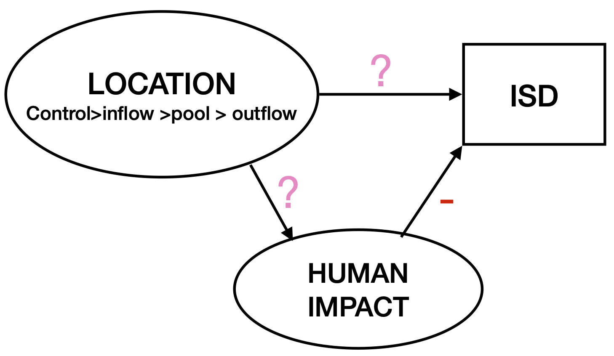

```{r loadlib}
library(tidyverse)
library(bayesplot)
library(DT)
library(here)
library(dplyr)
library(poweRlaw)
library(isdbayes)
library(brms)
library(tidybayes)
```

```{r ggplot_theme}
newtheme <- theme_bw(base_size = 14) 
theme_set(newtheme)
```

## Research questions:

::: callout-important
-   Does beaver damming influence arthropod individual size distribution (ISD)?

-   Does anthropogenic land area mediate the beaver effect on arthropods ISD ?
:::

## Load data

We are going to load the kick-net data set.

```{r load_data_k}
k = read.csv(here("data", "processed", "kicknet_clean.csv"))
```

### Standardize human influence

```{r stardize_k2}

k2 <- k  |>  
  mutate(across(c(human_influence), 
                ~ .x %>% scale() %>% as.vector(), 
                .names = "{.col}_z"),
         ecomorphology = as.factor(ecomorphology)) # ecomorphology as factor 
```

Then we add the column count:

```{r k3}
k3 <- k2 |> 
  mutate(counts = 1)
```

## Addressing body size undersampling

In field collections of body sizes, small organisms are commonly under-sampled. This contradicts that assumption of an exponential decline in frequency as body size increases and can lead to dramatically poor estimates of lambda [@clauset2009]. For this reason, [Jeff Wesner](jeff.wesner@usd.edu) and [Justin Pomeranz](jfpomeranz@gmail.com) strongly recommend checking for and removing under-sampled small sizes.

Let's state again with [Jeff Wesner](https://scholar.google.com/citations?hl=en&user=1J-5_yUAAAAJ&view_op=list_works&sortby=pubdate)'s words :

|  Why do we chose a power law distribution called the bounded Pareto distribution? Because [@edwards2017] had shown that it was the best option for fitting individual size distribution. In general power law distributions assume that abundance always decreases with size. But in most cases with real data, small things are harder to measure and they get undercounted. By itself, that means that the data do not follow a power law distribution. As [@clauset2009] explain, unless we have perfectly sampled data (which is impossible), then **our goal is to first find the range of data that *do* follow a power law distribution, which in turn means relying on some sort of cutoff/algorithm**. After that, we choose a power law distribution (i.e. the bounded pareto distribution in the `isdbayes` package) and go with it. But the type of distribution we choose in the second step is irrelevant to the first step. 

### Find and remove biased sizes 

How do we know if body sizes are under-sampled? One option is to use the `estimate_xmin()` function from the `poweRlaw` package [@gillespie2015] (to install the package read [here](https://github.com/csgillespie/poweRlaw)). It first fits the data to a power law (unbounded, but that’s OK here). Then it uses Kolmogorov-Smirnoff sampling to find the minimum body mass above which the data follow a power law.

::: callout-warning
Jeff Wesner:

This trimming procedure is sample-specific, not global. So if you have multiple samples, then you’ll need to run the `estimate_xmin` procedure on each sample, trim with a unique `xmin_est`, and recalculate xmin for each sample.
:::

### Trigger - cut off threshold

```{r trigger}

removal_summary <- k3 %>%
  group_by(site, location) %>%
  summarise(
    # Fit continuous power law and estimate xmin
    xmin_est = round({
      temp_mod <- conpl$new(dw)
      estimate_xmin(temp_mod)$xmin
    }, 2),
    # Total number of observations in this group
    total_obs = n(),
    # Number of observations below xmin (to be removed)
    removed_obs = sum(dw < xmin_est),
    # Proportion of observations below xmin
    prop_removed = round(removed_obs / total_obs * 100, 1),
    # Remaining observations after culling
    remaining_obs = total_obs - removed_obs,
    .groups = "drop"
  )
# --- remove observations ---
k5 <- k3 %>%
  left_join(removal_summary %>% select(site, location, xmin_est),
            by = c("site", "location")) %>%
  filter(dw >= xmin_est) %>%       # remove observations below xmin
  select(-xmin_est)  |>               # drop helper column if not needed
group_by(location, site)  |> # recompute the xmin and xmax
  mutate(
    xmin = min(dw, na.rm = TRUE),
    xmax = max(dw, na.rm = TRUE)
  )  |> 
  ungroup()

write.csv(k5, here("data","processed", "kicknet_triggered.csv"))
```

```{r}
#| label: tbl-cutoff
# dynamic data table to inspect
datatable(
  removal_summary,
  options = list(
    pageLength = 10,   # rows per page
    autoWidth = TRUE,  # auto adjust column widths
    searching = TRUE,  # allow search/filter
    ordering = TRUE    # allow sorting
  ),
  rownames = FALSE,
  caption = "Observations Removed per Site-Location"
)
```

> Jeff Wesner: note that the trimming can be quite large despite the relatively small `xmin_est` value. It can sometimes remove much more (such as 25 or 50%). That is usually not a problem as long as the remaining data has enough individuals to fit reliably, usually 300 or so.

::: callout-important
We trigger `r nrow(k3) - nrow(k5)` observations (`r round((nrow(k3) - nrow(k5)) / nrow(k3) * 100, 1)`%).

Remaining observations are:\
`r paste(k5 %>% count(location) %>% mutate(txt = paste0(location, " = ", n)) %>% pull(txt), collapse = "; ")`.
:::

## Preliminary data visualization

Q: Does ecomorphology vary by site and by location ?

```{r }
#| label: fig-variation_ecomorphology

ggplot(k2, aes( x = site, y = ecomorphology))+
  geom_point()+
  theme_bw(base_size = 14)+ 
  theme(axis.text.x = element_text(angle = 45, hjust = 1))
  
ggplot(k2, aes( x = location, y = ecomorphology))+
  geom_point()+
  theme_bw(base_size = 14)+ 
  theme(axis.text.x = element_text(angle = 45, hjust = 1)) 
```

Ecomorphology vary by site and by location.

Does human influence vary by site and location ?

```{r human_var_sentences}

sentences <- k2 %>%
  mutate(human_influence_z = round(human_influence_z, 2)) %>%
  group_by(site) %>%
  summarise(
    all_equal = n_distinct(human_influence_z) == 1,
    details = if (n_distinct(human_influence_z) == 1) {
      paste0("At site ", first(site), 
             ", all locations have the same human_influence_z value of ", 
             first(human_influence_z), ".")
    } else {
      paste0("At site ", site, " and location ", location, 
             ", the human_influence_z value is ", human_influence_z, ".",
             collapse = " ")
    },
    .groups = "drop"
  ) %>%
  pull(details)

sentences


```

```{r}
#| label: fig-humanbylocation
#| fig-cap: ""
#| 
ggplot(k2, aes( x = site, y = human_influence_z, color = location)) + 
  geom_point()+ 
  theme(axis.text.x = element_text(angle = 45, hjust = 1))
```

Human influence does not vary by site.

::: callout-note
Which distribution does the data look like?
:::

```{r , fig.width=10, fig.height=12}
#| label: fig-hist1
# Get unique sites
sites_list <- unique(k3$site)

# First 8 sites
k4_first8 <- k3 %>% filter(site %in% sites_list[1:8])

ggplot(k4_first8, aes(x = dw)) +
  geom_histogram(
    binwidth = 0.1,
    color = "black", 
    fill = "darkgrey"
  ) +
  facet_grid(site ~ location, scales = "free_y") +
  scale_x_continuous(limits = c(0,20)) +
  labs(
    title = "Kick net method (Sites 1–8)",
    x = "Dry weight (mg)",
    y = "Count", 
    subtitle = "Small invertebrate body sizes undersampled"
  ) 

# Next 8 sites
k4_next8 <- k3 %>% filter(site %in% sites_list[9:16])

ggplot(k4_next8, aes(x = dw)) +
  geom_histogram(
    binwidth = 0.1,
    color = "black", 
    fill = "darkgrey", 
    alpha = 0.7
  ) +
  facet_grid(site ~ location, scales = "free_y") +
  scale_x_continuous(limits = c(0,20)) +
  labs(
    title = "Kick net method (Sites 9–16)",
    x = "Dry weight (mg)",
    y = "Count", 
    subtitle = "Small invertebrate body sizes undersampled"
  )

```

Then we plot the triggered data frame:

```{r , fig.width=10, fig.height=12}
#| label: fig-histtriggered
# Get unique sites
sites_list <- unique(k5$site)

# First 8 sites
k5_first8 <- k5 %>% filter(site %in% sites_list[1:8])

ggplot(k5_first8, aes(x = dw)) +
  geom_histogram(
    binwidth = 0.25,
    #color = "white", 
    fill = "steelblue",
  ) +
  facet_grid(site ~ location, scales = "free_y") +
  scale_x_continuous(limits = c(0,20)) +
  labs(
    title = "Kick net method (Sites 1–8)",
    x = "Dry weight (mg)",
    y = "Count", 
    subtitle = "Small invertebrate body sizes removed"
  ) 

# Next 8 sites
k5_next8 <- k5 %>% filter(site %in% sites_list[9:16])

ggplot(k5_next8, aes(x = dw)) +
  geom_histogram(
    binwidth = 0.25,
    #color = "white", 
    fill = "steelblue", 
    alpha = 0.7
  ) +
  facet_grid(site ~ location, scales = "free_y") +
  scale_x_continuous(limits = c(0,20)) +
  labs(
    title = "Kick net method (Sites 9–16)",
    x = "Dry weight (mg)",
    y = "Count", 
    subtitle = "Small invertebrate body sizes removed"
  )

```

## M1: location influence on ISD

We are going to use the trimmed kick net data set. Remember that we have used the `estimate_xmin()` function from the `poweRlaw` package [@gillespie2015] to estimate the lower value (xmin) from which the data start to follow the power law - pareto distribution as suggested in [@clauset2009].

```{r load_triggered_data}

k5 <- read.csv(here("data","processed","kicknet_triggered.csv"))
```

First, the model formula:

```{r model_formula}

# formula 
form = bf(dw | vreal(counts, xmin, xmax) ~ 0  + location, # 0 + allows to see the four locations with its own lambda . if you do x ~ 1  + location, then control location will consider your reference level (intercept).
           family = paretocounts())

```

### Default priors

Second, which default priors are we using:

```{r check_priorss}

# see -the default / improper priors that the mdoel will use 
default_prior(object = form, data = k5 )
```

Third, let's set our own priors:

```{r setpriors}
#### set priors ####

pr  <- c( # prior for the average (intercept) of predictors 
  set_prior("normal(-1.20, 0.5)", coef = "locationControl"), # this is lambda for control location! )
  set_prior("normal(-1.20, 0.5)", coef = "locationOutflow"),
  set_prior("normal(-1.20, 0.5)", coef = "locationPool"),
  set_prior("normal(-1.20, 0.5)", coef = "locationInflow")
  ) 

```

Let's validate if the priors are retained by the model without errors:

```{r validapriors}
### validate priors: check if we have correctly state the priors

validate_prior(prior = pr, formula = form, data = k5 )
```

### Fit the model

Let's see if the model is going to work:

```{r fit_the_model}

m1 = brm(formula = form , 
           data = k5,
           prior = pr,
           stanvars = stanvars,
           family = paretocounts(),
           iter = 3000, 
           warmup = 1000,  # number of warmup iterations
           chains = 4,
           cores = 10, 
           threads = threading(2),
           seed = 7, # allow exact replication of results 
          file = here("results","models","m1_triggered"), # save the model. Please set your path folder. Note that if you want to refit the model, then you need to hide/deactivate this line of code 
        sample_prior = "yes" )# options: "yes", "no" or "only". If you want to sample from priors, use ONLY. 
```

Get the summary of the model:

```{r summarzm1}
summary(m1)
```

### Prior vs Posterior

```{r priorvsposterior}
# Let's also visualize them. 
tidy_inter <- mcmc_intervals_data(m1, prob = 0.66, # 66% intervals
                                  prob_outer = 0.95,
                                  #transformations =  "exp",
                                  pars = vars(contains(c("prior_", "b_"))))


tidy_inter1 <- tidy_inter %>%
  mutate(type = ifelse(grepl("^prior", sub("_.*", "", parameter)), "Prior", "Posterior"),
         parameter = gsub("^prior_", "", parameter) ) 
```

```{r}
#| label: fig-postvsprior
  
# 1. Redefine the custom labels map to use paste() and subscript notation
# The labels must be wrapped in 'expression()' and use the tilde (~) for spacing
# and the subscript notation.
parameter_expressions <- c(
  "b_locationControl" = expression(lambda[Control]),
  "b_locationInflow"  = expression(lambda[Inflow]),
  "b_locationOutflow" = expression(lambda[Outflow]),
  "b_locationPool"    = expression(lambda[Pool])
)

# 2. Plot using scale_y_discrete with the custom labels
ggplot(tidy_inter1, aes(x = m, y = parameter, color = type)) +
  geom_pointinterval(aes(xmin = l, xmax = h), position = position_dodge(width = 0.5), size = 8) +
  geom_pointinterval(aes(xmin = ll, xmax = hh), position = position_dodge(width = 0.5), size = 2) +
  
  # === KEY CHANGE HERE ===
  # Use the named vector for labels
  scale_y_discrete(labels = parameter_expressions) +
  
  theme_bw(base_size = 18) +
  labs(
    color = NULL,
    x = expression("Parameter value (" * lambda * ")"),
    y = NULL # Keep y axis title empty as the labels are descriptive
  ) +
  theme(axis.text = element_text(colour = "black"))
```

### Posterior lambdas prediction 

Plot posterior distributions using `add_epred_draws:`

::: callout-tip
Remember: `add_epred_draws` function is going to predict $\lambda$, with values like -2.1, -2.08, -1.2, etc.. If you remember, the bounded Pareto distribution uses the individual body sizes to predict the shape of the decline ($\lambda$) in frequency from small to large individuals. 
:::

```{r pp_epred}
pp = m1 |> 
   tidybayes::add_epred_draws(seed = 9, # assure reproducibility  
                      ndraws = 500,
                      newdata = k5)

#pp_sigma = m1 |> 
   #tidybayes::add_predicted_draws(seed = 9, # assure reproducibility  
                     # ndraws = 500,
                     # newdata = k5)
```

```{r }
#| label: fig-ggplot_epred
#| 
ggplot(data = pp, aes(y = location, x = .epred, fill = location)) + 
  stat_halfeye(scale = 0.5) +
  labs(x = expression(lambda),
     y = "location", 
     fill = "location")+
  theme_bw(base_size = 14)
```

### Test hypothesis

To test if beaver damming influence the ISD, we want to compare the ISD's $\lambda$ of the four location: `Control`, `Inflow`, `Pool`, `Outflow`.

We define the Range of Practical Equivalence (ROPE) as a small region around the null value (zero difference) where an effect is considered *negligibly small* for practical purposes, regardless of whether it's statistically different from zero. We choose $ROPE =  ±0.01$. Why ? Because  ±0.01 interval represents a difference in the exponent that is 1% or less of the total estimated value (e.g., 0.01 is 0.5% of 2 and 1% of 1 ). A difference of this magnitude is generally considered negligible because the resulting change in the frequency of rare events is minimal. For instance, in the power-law tail, a 0.01 difference in the exponent only results in a change in frequency of about 1% to 7% for values 10 to 1,000 times the minimum size, which is often too small to be meaningful in an ecological context. Therefore, if the posterior distribution for the difference is contained within ±0.01, we can confidently conclude that the difference between the two locations is practically equivalent to zero.

With the followin plot we will show the posterior probability of the difference in the Pareto exponent ($\lambda$) falling into three regions below the ROPE (a meaningful negative difference), within the ROPE (a practically null difference), or above the ROPE (a meaningful positive difference). Based on our ±0.01 ROPE, the interpretation hinges on the percentage text labels: if a comparison has a high percentage within the ROPE, it suggests the difference in $\lambda$ is too small to be meaningful; otherwise, it suggests a practically significant difference exists in that direction

```{r extract_posterior_draws}
# 1. Extract and spread the posterior draws of the mu coefficients (the alpha exponents)
draws_alpha_spread <- m1 |>
  tidybayes::spread_draws(
    b_locationControl,
    b_locationInflow,
    b_locationOutflow,
    b_locationPool
  )

# 2. Compute the differences and re-gather for plotting
differences <- draws_alpha_spread |>
  dplyr::mutate(
    # Control vs Pool
    Control_vs_Pool =  b_locationPool - b_locationControl ,
    # Control vs Inflow
    Control_vs_Inflow = b_locationInflow - b_locationControl  ,
    # Control vs Outflow
    Control_vs_Outflow =  b_locationOutflow - b_locationControl
  ) |>
  # Select only the comparison columns and re-gather for plotting
  dplyr::select(.draw, starts_with("Control_vs")) |>
  tidyr::pivot_longer(
    cols = starts_with("Control_vs"),
    names_to = "comparison",
    values_to = ".prediction" # Use .prediction to match the reference code structure
  )
```

```{r define_cutoff}
# Define cutoffs (Range of Practical Equivalence for difference in alpha)
# Adjust these based on what constitutes a negligible difference in your Pareto exponent.
cutoff_1 <- -0.01
cutoff_2 <- 0.01

# Compute proportions and create text strings for each comparison
summary_data <- differences |>
  dplyr::group_by(comparison) |>
  dplyr::summarise(
    prop_above = 100 * sum(.prediction > cutoff_2) / dplyr::n(),
    prop_below = 100 * sum(.prediction < cutoff_1) / dplyr::n(),
    prop_rope = 100 * sum(.prediction >= cutoff_1 & .prediction <= cutoff_2) / dplyr::n()
  ) |>
  dplyr::mutate(
    above_txt = paste0(round(prop_above, 1), " %: Diff > ", cutoff_2),
    below_txt = paste0(round(prop_below, 1), " %: Diff < ", cutoff_1),
    null_txt = paste0(round(prop_rope, 1), " %: ROPE")
  )

# Merge the text strings back into the differences data for plotting labels
plot_data <- differences |>
  dplyr::left_join(summary_data, by = "comparison")
```

```{r}
#| label: fig-hypothesis
# 1. Define the custom labels for faceting
facet_labels <- c(
  "Control_vs_Pool" = "Pool - Control ",
  "Control_vs_Inflow" = "Inflow - Control",
  "Control_vs_Outflow" = "Outflow - Control"
)

# Fill colors (redefined for completeness)
fill_colors <- c(
  sink = "coral",
  ROPE = "lightgrey",
  source = "skyblue"
)

# 2. Plot the differences using facets with the new labels
(p_differences <- ggplot(plot_data, aes(x = .prediction)) +
  # Use the 'labeller' argument to apply the custom labels
  facet_wrap(~ comparison, ncol = 1, scales = "free_y", labeller = labeller(comparison = facet_labels)) +
  stat_halfeye(
    aes(
      y = 0,
      fill = after_stat(case_when(
        x < cutoff_1 ~ "sink",
        x > cutoff_2 ~ "source",
        TRUE ~ "ROPE"
      ))
    ),
    adjust = 0.8,
    slab_alpha = 0.8,
    show.legend = FALSE
  ) +
  geom_vline(xintercept = c(cutoff_1, cutoff_2), linetype = "dashed", color = "black") +
  scale_fill_manual(values = fill_colors) +
  scale_x_continuous(breaks = seq(-3, 3, 0.5)) +
  theme_bw(base_size = 14) +
  theme(
    legend.position = "none",
    axis.title.y = element_blank(),
    axis.text.y = element_blank(),
    axis.ticks.y = element_blank(),
    panel.grid.major = element_blank(),
    panel.grid.minor = element_blank(),
    panel.background = element_blank(),
    strip.text = element_text(face = "bold") # Ensure labels are clear and bold
  ) +
  labs(
    x = expression("Difference in arthropod ISD exponent (" * lambda["Control"] - lambda["Other"] * ")"),
    y = NULL
  ) +
  # Add region labels for each facet using geom_text
  geom_text(
    data = summary_data,
    aes(x = min(plot_data$.prediction) - 0.1, y = 0.1, label = below_txt),
    hjust = 0, size = 3.5, check_overlap = TRUE
  ) +
  geom_text(
    data = summary_data,
    aes(x = 0, y = 0.12, label = null_txt),
    hjust = 0.5, size = 3.5
  ) +
  geom_text(
    data = summary_data,
    aes(x = max(plot_data$.prediction) + 0.1, y = 0.1, label = above_txt),
    hjust = 1, size = 3.5, check_overlap = TRUE
  )
)
```

### Results

-   We found that with 87% probability `inflow` ISD exponent ($\lambda$) was higher than `control` ISD exponent.

-   We found strong evidence (100% probability) that `outflow` ISD exponent ($\lambda$) was higher than the `control` ISD exponent.

-   Our data indicated that with 60% probability `pool` ISD exponent ($\lambda$) was higher than the `control` ISD exponent.

### Conclusions

The beaver damming creates habitats (`Inflow`, `Outflow`, `Pool`) that systematically lead to a less steep macro invertebrates body size distribution (less negative λ), suggesting these locations are relatively more favorable for large-bodied macroi nvertebrates compared to stream locations where beaver do not exert his damming activity.

## M2: Human influence\*beaver and ISD

**Human influence**

These variable represents soil cover extension (square meters $m^2$ ) that is defined as agriculture or urban. by Valentin Moser downloaded soil area extension for each site from Geodienste.ch and swisstopo.admin.ch using ARCGIS (Pro v. 2.8, Esri Inc., 2021 und QGIS 3.40 'Bratislava' 2024). He selected a radius of 250 meters around the center of each `Pool` location So it is a variable that varies by site and not by location. A visual inspection of the data showed highly reliable classification for agricultural (e.g., crop fields, pastures, areas that farmers maintain for biodiversity) and natural (e.g., forests, riparian areas) land-use. Areas without classified land-use were very often urban areas and human infrastructure, such as streets, railways, and housing. Therefore, missing data was assigned to urban land-use. Finally, he aggregated agricultural and urban land cover estimates into an overall human impact variable called `human_influence`**.**

Let's first draw a directed acyclic graph that represent our hypotheses:

{#fig-DAG width="483"}

Now let's define the model formula:

```{r model_formula_humaninfluence}

# formula 
form = bf(dw | vreal(counts, xmin, xmax) ~ 0  + location*human_influence_z, # 0 + allows to see the four locations with its own lambda . if you do x ~ 1  + location, then control location will consider your reference level (intercept).
           family = paretocounts())
```

### Default priors

Let's see the default priors

```{r dfpriors}

default_prior(object = form, data = k5)

```

Flat priors... mmmh, that's not a good default setting to see and use. This is because if we use flat priors, we are allowing the model to predict whatever lambda value, be positive or negative. And that's just not the case: we already know that lambda should be in between -2 and -1 range.

### Set priors

Let's define our priors that makes sense:

```{r definepriors}

#### set priors ####

pr_human  <- c( # prior for the average (intercept) of predictors 
  set_prior("normal(-1.20, 0.5)", coef = "locationControl"), # this is lambda for control location! )
  set_prior("normal(-1.20, 0.5)", coef = "locationOutflow"),
  set_prior("normal(-1.20, 0.5)", coef = "locationPool"),
  set_prior("normal(-1.20, 0.5)", coef = "locationInflow"),
  set_prior("normal(0, 0.2)", coef = "human_influence_z"),# how much land area  by agricolture and urban settlement infleucne lambda ?
  set_prior("normal(0, 0.2)", coef = "locationInflow:human_influence_z"), # inflow and human influence
  set_prior("normal(0, 0.2)", coef = "locationOutflow:human_influence_z"), # outflow and human influence 
  set_prior("normal(0, 0.2)", coef = "locationPool:human_influence_z") # pool and human influence 
  ) 
```

### Validate priors

```{r val_priors}

validate_prior(pr_human, formula = form, data = k5)

```

### Model fit 

Fit the model:

```{r fit_human_location}

m2 = brm(formula = form , 
           data = k5,
           prior = pr_human,
           stanvars = stanvars,
           family = paretocounts(),
           iter = 3000, 
           warmup = 1000,  # number of warmup iterations
           chains = 4,
           cores = 10, 
           threads = threading(2),
           seed = 77, # allow exact replication of results 
         sample_prior = "yes",# options: "yes", "no" or "only". If you want to sample from priors, use ONLY. 
         file = here("results","models","m2_triggered"))

```

Let's see the summary:

```{r summ_m2}

summary(m2)
```

### Posterior epred:

```{r pp_epred_m2}
pp_m2  <-  m2 |> 
           add_epred_draws(seed = 9, # assure reproducibility  
                      ndraws = 500,
                      newdata = k5)
```

### Plot lambda 

```{r }
#| label: fig-plot_lambda_human
ggplot(pp_m2, aes(x = human_influence_z, y = .epred, group = location, color = location, fill = location)) +
  stat_lineribbon(
    .width = 0.95, # Specifies the confidence level for the ribbon
    alpha = 0.3 # Adds transparency to the ribbon so the line shows through
  )+ 
  labs(y = expression(lambda))

```

## Vignettes for using `isdbayes`

You can see the original vignettes [here](https://github.com/jswesner/isdbayes).

First, simulate some power law data using `rparetocounts()` function from the `isdbayes` package. The code below simulates 300 body sizes from a power law with exponent lambda = -1.2, xmin = 1, and xmax = 1000. In other words, `rparetocounts()`simulates body sizes between 1 and 1000 with frequencies corresponding to lambda = -1.2.

```{r simdata}

# simulate data. 

dat = tibble(dw = rparetocounts(n = 300,  lambda = -1.2,  xmin = 1, xmax = 1000)) |> 
  mutate(xmin = min(dw),
         xmax = max(dw),
         counts = 1)
```

## Model fit

Next estimate the power law exponent using `brms`. The model below (`fit1`) is an intercept only model, where x are the body sizes and counts, xmin, and xmax are included in `vreal()`. The use of `vreal` has nothing to do with the model per se. It is simply required wording from `brms` when including custom families. Similarly, `stanvars` is required wording that contains the custom likelihood parameters. As long as `isdbayes` is loaded, then `stanvars = stanvars` will work. It will stay the same regardless of changes to the model structure (like new predictors or varying intercepts).

```{r set_formula}
# formula 
bform = bf(dw | vreal(counts, xmin, xmax) ~ 0 + Intercept, # 0 + Intercept is the same as ~ 1, but the first is an explicit way to code the intercept. While the second is implicit. In this case the intercept is our lambda 
           family = paretocounts())

# see the default / improper priors that the mdoel will use 
default_prior(object = bform, data = dat )
#### set priors ####

pr  <- c( # prior for the average (intercept) of predictors 
  set_prior("normal(-1.20, 0.5)", coef = "Intercept") # this is lambda ! )
  ) 
### validate priors: check if we have correctly state the priors

validate_prior(prior = pr, formula = bform, data = dat )

# yes ! Now our model is expecting to find lamba values in between -1.2 +- 0.5 
```

```{r fit_model}

fit0 = brm(formula = bform, 
          data = dat,
          stanvars = stanvars,    # required for truncated Pareto
          family = paretocounts(),# required for truncated Pareto
          prior = pr, # here we set the priors 
          chains = 3, 
          warmup = 500, 
          iter = 1000, 
          seed = 7, # allow exact replication of results 
          file = here("results","models","fit0"), # save the model. Please set your path folder. Note that if you want to refit the model, then you need to hide/deactivate this line of code 
        sample_prior = "no"  # default option. Indicate if draws from priors should be drawn additionally to the posterior draws.
          )
```

```{r summary}

summary(fit0)
```

Plot posterior distribution of lambda:

```{r posterior_draws}
p = fit0 |> 
   add_epred_draws(seed = 9, # assure reproducibility  
                      ndraws = 1000,
                      newdata = dat)
```

```{r plot_lambda}
p |> 
  ggplot(aes(x = .epred, y = 0)) + 
  stat_halfeye() + 
  labs(x = expression(lambda))+
  theme_bw(base_size = 14)+
  theme(
    axis.title.y = element_blank(),
    axis.text.y = element_blank(),
    axis.ticks.y = element_blank()
  )
```

## Fit multiple size distributions with a fixed factor

Now we are going to simulate data sampled in four different `locations.`

```{r simdata_multilevels}

control = rparetocounts(lambda = -1.8) # `lambda` is required wording from brms. in this case it means the lambda exponent of the ISD
inflow = rparetocounts(lambda = -1.5)
pool = rparetocounts(lambda = -1.2)
outflow = rparetocounts(lambda = -1.1)

isd_data = tibble(control = control,
                  inflow = inflow,
                  pool = pool,
                  outflow = outflow) |> 
  pivot_longer(cols = everything(), names_to = "group", values_to = "dw") |> 
  group_by(group) |> 
  mutate(xmin = min(dw),
         xmax = max(dw)) |> 
  group_by(group, dw) |> 
  add_count(name = "counts")
```

Set formula and priors:

```{r setmultilevel_formula}

# formula 
bform2 = bf(dw | vreal(counts, xmin, xmax) ~ 0  + group, # 0 + allows to see the four locations with its own lambda . if you do x ~ 1  + group, then control location will consider your reference level. Try by yourself . 
           family = paretocounts())
```

### Set the priors

```{r set_priors}
# see the default / improper priors that the mdoel will use 
default_prior(object = bform2, data = isd_data )
#### set priors ####

pr  <- c( # prior for the average (intercept) of predictors 
  set_prior("normal(-1.20, 0.5)", coef = "groupcontrol"), # this is lambda for control location! )
  set_prior("normal(-1.20, 0.5)", coef = "groupinflow"),
  set_prior("normal(-1.20, 0.5)", coef = "grouppool"),
  set_prior("normal(-1.20, 0.5)", coef = "groupoutflow")
  ) 
### validate priors: check if we have correctly state the priors

validate_prior(prior = pr, formula = bform2, data = isd_data )

# yes ! Now our model is expecting to find lamba values in between -1.2 +- 0.5 
```

### Fit the model

```{r fit2}

fit2 = brm(formula = bform2 , 
           data = isd_data,
           stanvars = stanvars,
           family = paretocounts(),
           chains = 4, 
           iter = 1000,
           seed = 7, # allow exact replication of results 
          file = here("results","models","fit2"), # save the model. Please set your path folder. Note that if you want to refit the model, then you need to hide/deactivate this line of code 
        sample_prior = "no" )
```

Plot posterior distributions, a.k.a:

```{r posterior_draws2}

p2 = fit2 |> 
   add_epred_draws(seed = 9, # assure reproducibility  
                      ndraws = 1000,
                      newdata = isd_data)
```

Plot the lambdas

```{r plotlambdas}

# data frame of known lambda values
lambda_vals <- data.frame(
  group = c("control", "inflow", "pool", "outflow"),
  lambda = c(-1.8, -1.5, -1.2, -1.1)
)


ggplot(data = p2, aes(y = group, x = .epred, fill = group)) + 
  stat_halfeye(scale = 0.5) + 
  # add stars at the right group + lambda
  geom_point(
    data = lambda_vals,
    aes(x = lambda, y = group),
    shape = 8,   # star
    size = 4,
    color = "red"
  ) +
  labs(x = expression(lambda),
     y = "location", 
     fill = "location",
     subtitle = "Red stars represent the a priori simulated value of lambdas")+
  theme_bw(base_size = 14)+ 
  scale_x_continuous(breaks = seq(-2, -1, by = 0.25), limits = c(-2,-1))
```

## Visualize ISD

> Jeff Wesner: This code extracts the cumulative probabilities using `pparetocounts()` and the plots them over raw data. Note that the raw data probabilities are simply estimates for visualization purposes. These plots are typical in studies of the ISD and are visually similar to plots of log-abundance vs log-size, making them more familiar to readers (maybe).

```{r visualize_isd}


# 1) sort raw data
d = fit0$data |>
  arrange(-dw) |> 
  mutate(order = row_number(),
         y_raw_prob = order/max(order)) # convert to 0-1 scale

# 2) data grid to sample over
data_grid = d |>
  distinct(xmin, xmax) |> 
  expand_grid(dw = 2^seq(log2(min(d$dw)), log2(max(d$dw)), length.out = 30)) |> # sequence is log 2 to ensure equal logarithmic spacing
  mutate(counts = 1) # This is a default. Even if counts are >1 inthe raw data, make them = 1 here.

# 3) extract posteriors
isd_posts = data_grid |> 
  tidybayes::add_epred_draws(fit0)

# 4) get cumulative probabilities from posteriors
isd_lines = isd_posts |> 
  rowwise() |> 
  mutate(y_prob = pparetocounts(x = dw, xmin = xmin ,xmax = xmax, lambda = .epred))

# 5) plot raw vs posterior samples
isd_lines |> 
  filter(.draw <= 100) |> # limits to the first 100 draws. Change as needed or use a summary to plot instead of individual lines
  ggplot(aes(x = dw, y = y_prob)) + 
  geom_line(aes(group = .draw), alpha = 0.3) +
  geom_point(data = d, aes(y = y_raw_prob),shape = 21, fill = "white", color = "black") +
  labs(y = "P(X >= x)")+
  theme_bw(base_size = 14)
```

## References
