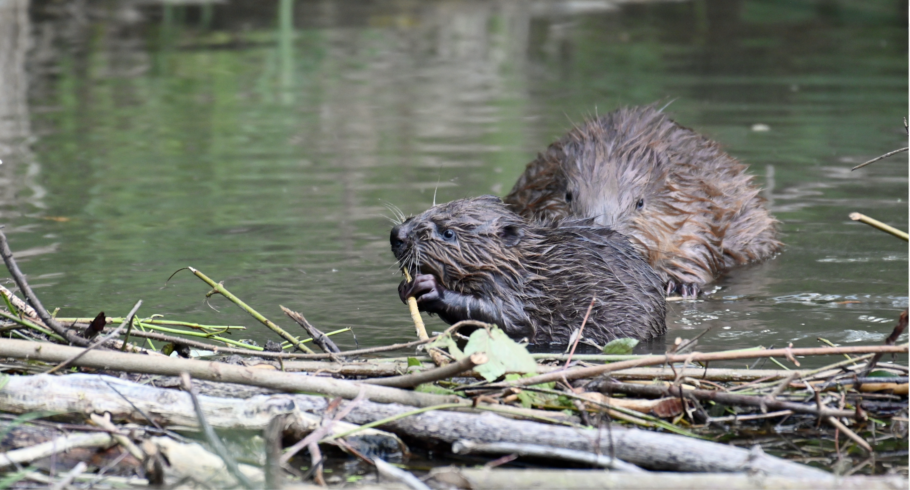
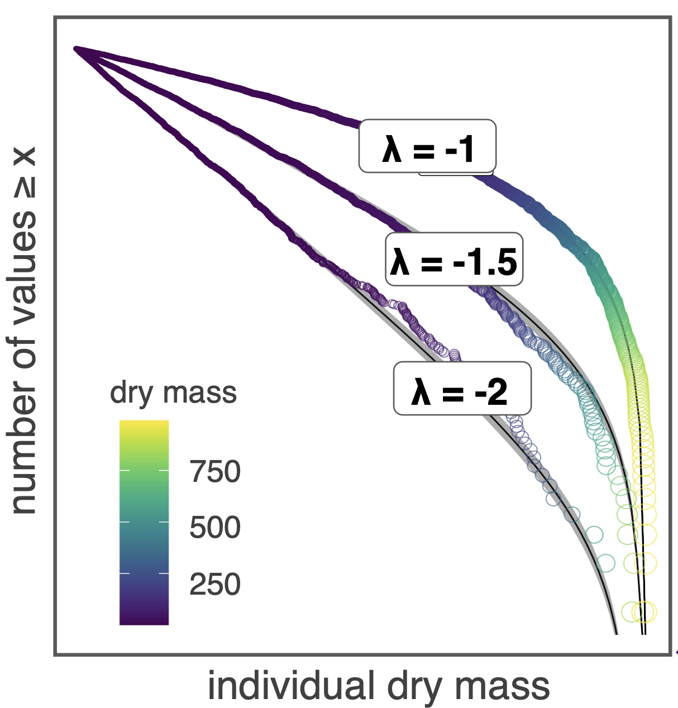
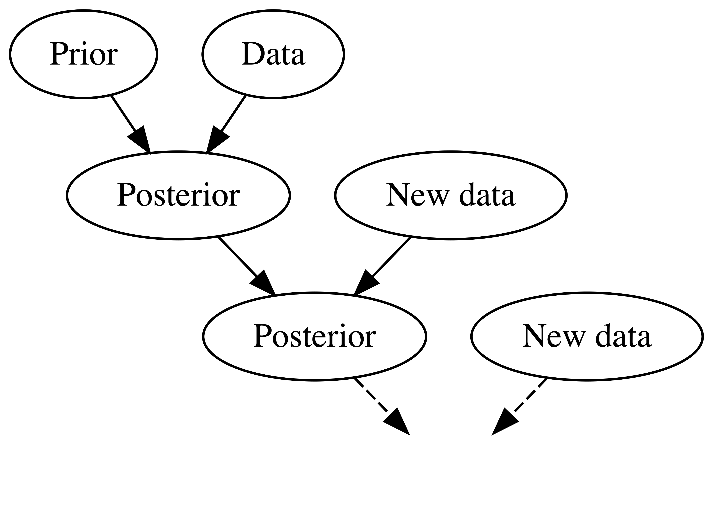

## First things first

{fig-align="right" width="133"}

*The most important things should be done before anything else.*

We want to tell you something:

The first important thing you should do when you are going to start a research project is to think about open-unsolved question(s). Why? Well, research questions play a central role in the scientific method because they indicate the problem that is being addressed, and clearly state what is being investigated [@thelwall2020]. Indeed, the presence of research questions within a research article is an established quality indicator. In fact, research questions form the basis of determining hypotheses, methods, and how interpretations and analysis of outcomes are undertaken [@covvey2024]. Once you have a good question to investigate, you can begin to think of ways to answer it! To prevent you to waste time and effort, we suggest to invest fully in the creation of rigorous research questions. Remember: first things first.

## Research questions

Therefore, the open questions we will answer are as follow:

::: callout-important
**Open questions:**

-   Does beaver damming influence arthropod individual size distribution (ISD)?

-   Does anthropogenic land area mediate the beaver effect on arthropods ISD ?

-   ... your question (maybe something about terrestrial vs aquatic ISD) ?
:::

Within this research project, you will get access to data that represent the terrestrial and aquatic arthropod community. We used three (3) different methods, catching different insect taxon. The three methods from now on we defined as: `emergent_trap`, `kick_net`, `suction`. You will find more info and details about these methods in the file `0_sampling_methods.html`

### Beavers

[{#fig-beavers fig-align="right" width="347"}](https://dominictinner.pro)

You may ask: why do we want to study **beavers**?

The answer is straightforward: beavers (*Castor fiber, Castor canadensis*) are one of the most influential mammalian ecosystem engineers, heavily modifying river corridor hydrology, geomorphology, nutrient cycling, and ecosystems [@larsen2021]. Eradicated at the start of the 19th century, beavers can now be found once again across the Switzerland lowlands. Particularly in the last ten years, they have become so widespread that five to six thousand individuals are currently estimated to live in Swiss streams [@angst2023]! Until now, however, it was unclear whether this was also true of urban and agricultural streams – in other words, precisely those streams that the beavers predominantly inhabit today. Researchers from Eawag and the University of Lausanne have shown that this is indeed the case: beaver ponds not only increased the arthropods biodiversity of two streams in agricultural areas, but also altered the organic matter supply available to them [@robinson2020].

### Individual size distribution

You may ask: why do we want to study the arthropods' individual size distribution ?

The individual size distribution (ISD, often referred to in the aquatic literature as the size spectra) is the relationship between abundance and individual body mass [@white2007]. More generally, this is a frequency distribution (or probability density) of body mass of individuals in a community. Generally, there is a negative relationship between individual body size ($M$, measured in mass) on the x-axis and abundance (N) on the y-axis. Indeed, ISDs have often been characterized using a power-law, where the frequency of individuals of body size $M$ follows a function of the form:

$$f(M) \propto M^{\lambda}$$

where $\lambda$, called the lambda exponent, is the rate of decline from small to large individuals (i.e., $\lambda < 0$).

What lambda ($\lambda$) values ​​should we expect?

From different global analysis, $\lambda$ is restricted to a relatively narrow range between about −2.05 and −1.2 [@wesner2024]. For example, global analysis of phytoplankton reveals values of $\lambda = −1.75$ , consistent with predictions based on sublinear scaling of metabolic rate with mass of −3/4 [@perkins2019].

[{#fig-gjoni fig-align="center" width="492"}](https://www.biorxiv.org/content/10.1101/2024.01.09.574822v1)

#### Ecological implications

The lambda exponent can be considered as an emergent property of community interactions, most notably trophic energy transfer [@mehner2018]. Flatter $\lambda$ slopes indicate energy passing more efficiently from small, low-trophic position individuals to larger, high-trophic position individuals [@blanchard2009; @mehner2018]. However, there are multiple processes that may disrupt this, in particular, deviations in the relationship between body size and trophic position associated with large individuals feeding at low trophic levels (e.g., [@broadway2015]. In the past, $\lambda$ has been used to address offshore oceanic fishing yields [@blanchard2014; @law2023; @kolding2016], changes in ecosystem health relative to climate change [@queirós2018; @pomeranz2022], and the effects of oligotrophication, eutrophication, pollution, and invasive species [@arranz2023; @buba2017; @murry2024; @pomeranz2019; @murry2014]. Specifically, fishery exploitation tends to steepen $\lambda$ [@jennings2005], whereas abundance shifts to large-bodied low position fish tends to flatten $\lambda$ [@broadway2015; @murry2024].

::: {.callout-tip appearance="minimal"}
## **Your turn:**

**Expectations/hypothesis:**

-   What do you expect about beaver damming influence on $\lambda$ ? Will $\lambda$ be higher or lower in the beaver influenced locations?

-   How will $\lambda$ vary as a function of the anthropocentric land area close to the stream ?

-   How will $\lambda$ vary as a function of beaver damming AND anthropocentric influence?

Please draw here some expectations:
:::

## Methods

### Data

The data we have are described in the file `0_sampling_methods.html`.

### Statistical analysis

Traditionally, the ISD is binned into arbitrarily defined body mass classes in a geometric series (Platt and Denman 1977; Silvert and Platt 1978); however, the parameters estimated may be sensitive to the bin width selected [@edwards2017] and to the size metric considered (e.g., biomass, biovolume or length) [@sprules2016]. In addition, ISD fitted with binning-based methods are usually normalized by dividing the abundance (or biomass) by the width of the size classes [@sprules2016]. To avoid the bias introduced by the use of binned data, more recent approaches have shown that fitting the ISD with either a Pareto probability distribution or estimating parameters by maximum likelihood estimation (MLE) can provide more robust and accurate estimates of exponents than binning-based methods [@edwards2020; @vidondo1997; @white2007]. Indeed, @edwards2017 found that treating abundance and body-size data as a probability distribution (i.e., power-law distribution; $f(M) \propto M^{\lambda}$) and solving for the exponent $\lambda$ (using likelihood or bayesian methods) was analogous to calculating the slope through linear regression on logarithmic axes.

### Bayesian data analysis

We may agree that the specification of a model that approximates the *true* data-generating process is central to any statistical analysis. The Bayesian theorem allows you to do exactly this. You can use prior ecological knowledge and combined it with observed data through the likelihood to reflect updated a posteriori knowledge in the form of posterior probability distributions for all model parameters (i.e. the posteriors). A quote from chapter 1, of [\@johnson2022](%5Bonline%20version%5D(https://www.bayesrulesbook.com/chapter-1#thinking-like-a-bayesian)):

[{#fig-bayesreason fig-align="left" width="335"}](https://www.bayesrulesbook.com/chapter-1#thinking-like-a-bayesian)

> Suppose there’s a new Italian restaurant in your town. It has a 5-star online rating *and* you love Italian food! Thus, prior to ever stepping foot in the restaurant, you anticipate that it will be quite delicious. On your first visit, you collect some edible data: your pasta dish arrives a soggy mess. Weighing the stellar online rating against your own terrible meal (which might have just been a fluke), you update your knowledge: this is a 3-star not 5-star restaurant. Willing to give the restaurant another chance, you make a second trip. On this visit, you’re pleased with your Alfredo and increase the restaurant’s rating to 4 stars. You continue to visit the restaurant, collecting edible data and updating your knowledge each time.

![Your evolving knowledge about a restaurant. Same logical reasoning that Bayes theorem is based on. Credits to [@johnson2022]](images/restaurant_diagram.png){#fig-rest width="544"}

[{#fig-revbayes fig-align="right" width="161"}](https://en.wikipedia.org/wiki/Thomas_Bayes)

Following the Bayesian theorem allows you to:

-   simulate data given your model;

-   include prior ecological knowledge on the model's parameters values: what is it probable, possible or unreasonable?;

-   clearly see the assumptions and mechanisms in your model: what different parameter values do to the model's outcomes;

-   do the great partial pooling (sometimes referred interchangeably to as multilevel, mixed effects, or random effects models);

-   make claims like: "there is 30% probability that the treatment improve the outcome".

What else do you want ?

### ISD analysis under bayesian approach

Now, for what to concern the estimation of the arthropod ISD, we can follow [@wesner2024]. Specifically, Jefff Wesner and collaborators created the `isdbayes` package to fit Bayesian (non)-linear hierarchical models with a truncated Pareto likelihood using `brms` package ([Bürkner 2017](https://cran.r-project.org/web/packages/brms/index.html)). The motivation for the package was to estimate power law exponents of ecological ISD using individual-level body size data in a generalized mixed model framework. The likelihood for the truncated Pareto used here was described in [@edwards2020]. This package translates that maximum likelihood estimation into the `brms` package.

::: callout-important
If you are not willing to use the `isdbayes` package, you can use the `sizespectra` package proposed by Edwards et a. 2016. It is based on maximum likelihood method. Please refer to the Github webpage and the vignettes for details and examples. ([GitHub](https://github.com/andrew-edwards/sizeSpectra?tab=readme-ov-file), [Vignettes](https://htmlpreview.github.io/?https://github.com/andrew-edwards/sizeSpectra/blob/master/doc/vignettes_overview.html)).
:::

If you decide to use the `isdbayes` package, please read this README.rmd made by Wesner et al ([link](https://github.com/jswesner/isdbayes)).

## To do

::: callout-note
### 17.09.2025: 1.45 hours

**From 15 h till 16:45h**

This session will be online with Leonardo Capitani. Link with zoom (link [here](https://us02web.zoom.us/j/7894473633?pwd=Wi83TXJyUGhwZytpU3lEWXJSaTl0UT09)). You should use these 1.45 hours to:

-   Read the file: `instructions.html.` Focus on open questions and expectations. Invest 30 min.

-   Read the file: `0_sampling_methods.html.`Focus on the **Description** sections. Invest no more than 20 min.

-   Read @moser paper. Focus on **methods** section. Invest no more than 15 min.

Answer these questions:

\- How many sampling method did we use to sample the arthropods community?

\- What is the arthropod ISD?

\- How do you define your experience with R ?

\- Have you ever heard about the statistical approach called *bayesian* ?

Note the answers in your notebook, please.

**At the end of this session, you should:**

-   think and formulate an open question about the research project: beaver and terrestrial vs aquatic arthropod's ISD.
:::

::: callout-note
### 19.09.2025: **3.45 hours**

**from 08:15 till 12h**

This session will be online with Leonardo Capitani. Link with zoom (link [here](https://us02web.zoom.us/j/7894473633?pwd=Wi83TXJyUGhwZytpU3lEWXJSaTl0UT09)). You should use these 3.45 hours to:

Please note that when we talk about expectations we refer as a synonym of the word *hypotheses*.

Please read @pomeranz2024: Maximum likelihood outperforms binning methods for detecting differences in abundance size spectra across environmental gradients.

-   Answer this question: What is your expectation about question 1? Will $\lambda$ be higher or lower in beaver's influenced locations (inflow, pool, outflow) compared to control location?

-   Draw in your notebook the expectation for question 1 as a figure like @fig-gjoni

-   Answer this question: What is your expectation in regards to question 2?

-   Draw in your notebook the expectation for question 2 as a figure like @fig-gjoni

-   Discuss and compare your expectations with your colleagues, Leonardo and Francesco. 10-15 min max.

-   Decide which sampling method-arthropod community do you want to use.

-   Are you able to load in R the processed data?

-   Plot an histogram of the arthropod weight by location. See as an example, figures in `0_sampling_methods.html`
:::

::: callout-note
### 01.10.2025: 3.45 hours

**from 13 h till 16:45h**

This session will be at Eawag (FXB 01) with Leonardo Capitani. You should use these 3.45 hours to:

-   Discuss in group our expectations / hypothesis for research question 1 and 2

-   Play and visualize the data: kick net only

-   Replicate in R the `isdbayes` package tutorial from this [link](https://github.com/jswesner/isdbayes)

-   If time: how do the priors influence the posterior distribution of your model?
:::

::: callout-note
### 03.10.2025: 3.45 hours

**from 08:15 till 12h**

This session will be at Eawag (FXB 01) with Leonardo Capitani. You should use these 3.45 hours to:

-   Play with your first model: how do the priors influence the posterior distribution of your model?

-   Fit your first model to kick net data: what is the model formula that we are going to use to answer the first question ?
:::

::: callout-note
### 08.10.2025: 3.45 hours

This session will be at Eawag (FXB 01) with Leonardo Capitani. You should use these 3.45 hours to:
:::

::: callout-note
### 09.10.2025: 3.45 hours

This session will be at Eawag (FXB 01) with Leonardo Capitani. You should use these 3.45 hours to:
:::

::: callout-note
### 10.10.2025: 3.45 hours

Leonardo and Francesco will be absent in this session. You should use these 3.45 hours to:

-   make one figure that answers question 1

-   make one figure that answers question 2

-   Given your figure 1, what is the take home message of this figure? State it in one or two sentences. These sentences answer question 1.

-   Given figure 2, what is the take home message of this figure? State it in one or two sentences. These sentences answer question 2.
:::

::: callout-note
### 15.10.2025: 3.45 + 3.45 hours

Francesco will be present in this session. You should use these 3.45 hours to:

-   Communicate to Francesco what are the answers to question 1 and question 2 using the figures you have made. Make some bullets points on this topic.

-   Answer and discuss with Francesco: Does these results support, contradict your expectations/hypothesis? Make some bullets points on that.

-   Does your results support / contradict previous studies about arthropods ISD?

-   Answer this question: Why are your results important for the Ecology community?

-   Answer this question: What are the caveats of your analysis ?
:::

## References
